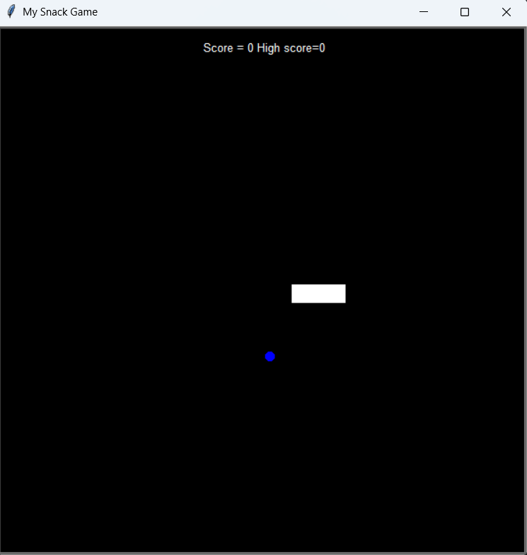

# 🐍 Snake Game (Python)

A simple and fun Snake Game built using Python's Turtle Graphics and Object-Oriented Programming (OOP) principles. This project helped me practice classes, modular programming, and event-driven game design.

---

## 🎮 Features
- Snake movement using arrow keys
- Randomly spawning food
- Score tracking
- Game over detection:
  - Hitting walls
  - Colliding with itself
- Clean object-oriented design (Snake, Food, Scoreboard classes)

---

## 🧠 Concepts Practiced
- Classes & Objects
- Loops and Conditional Statements
- Functions & Methods
- Turtle Graphics for GUI
- Event Listeners (`onkey`) for real-time input

---
## 📸 Screen shot


## 🚀 How to Run
1. Clone the repository:
   ```bash
   git clone https://raghul2112.github.io/Snack_Game/

